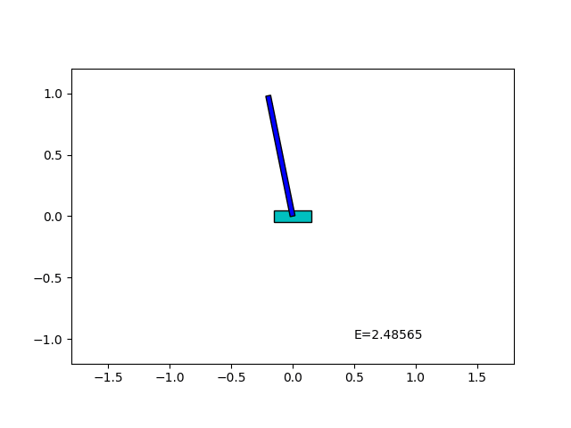



# Simple Simulation

This is an experimental implementation of simulation of an inverted pendulum.

## Why I made this

This is the very first step of my plan.

Since I am a beginner in Python, first I wanted to start with a small program.

I am going to study optimization and machine learning.

I am planning to experiment with automatic design of optimal control by physics simulation.
