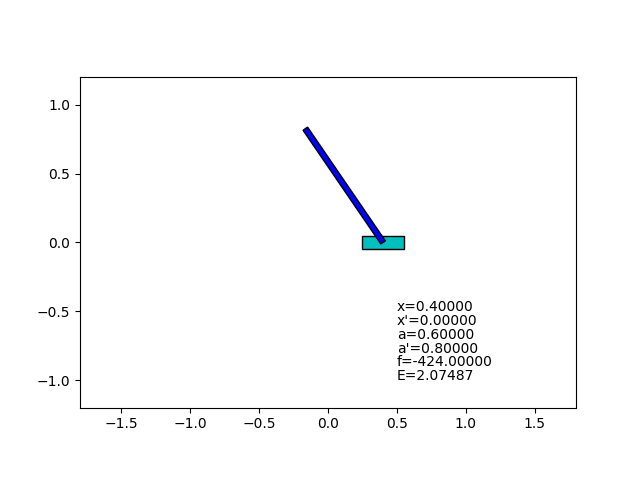



# State Feedback

This is a simulation of an inverted pendulum with a linear state feedback controller.
The feedback gain was adjusted manually with trial and error.

The simulated inverted pendulum model is identical to [the previous implementation (Simple Simulation)](../prog01_simple_simulation).

## What I thought

I intended to realize how hard manual adjustment of controller parameters is, and that was really so hard.
The controller so often fails to stabilize the pendulum due to its initial state.

Of course I know, we have control theory.
Control theory teaches us how to design a stable controller.
For linear systems, the theory provides even a nearly automated method to design optimal controllers.
However for non-linear systems, even though there are many studies on this field, as far as I know, there are no general way to design controllers.

## Changelog

### 2018-08-18
- Initial version
