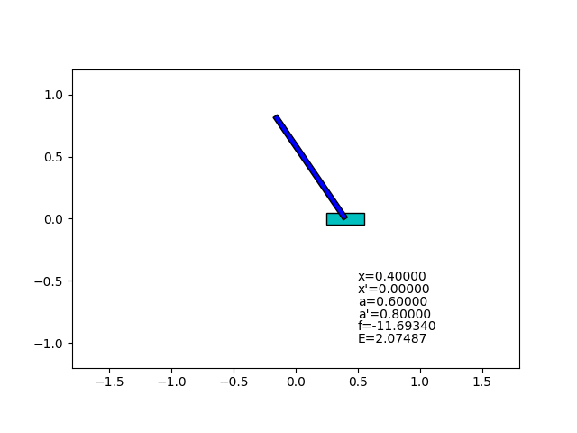



# Optimization of State Feedback

This is an optimization experiment of a linear state feedback controller.
In contrast to the [previous one](../prog02_state_feedback) (which uses manually adjusted feedback gain),
this program uses optimization.

The feedback gain is optimized using an inverted pendulum simulator with 1000 random initial states,
minimizing the mean of squared state value at 1 second later.
This optimization is performed using TensorFlow machine learning framework.

## What I thought

I think this optimization is a supervised learning rather than a reinforcement learning,
because the parameters (feedback gain) are directly updated using derivative of simulation result.

Optimization is fun.
