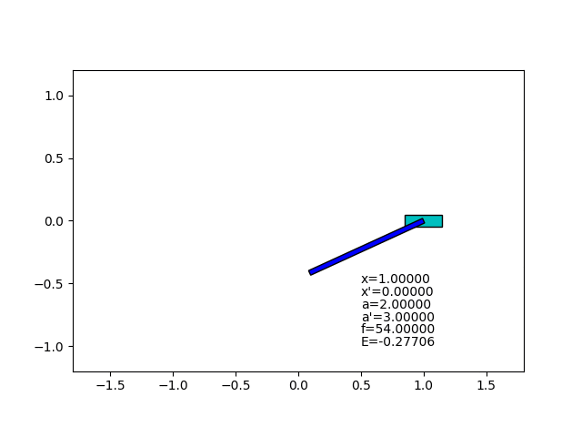



# Swing-up Control

This is a simulation of an inverted pendulum with a manually adjusted swing-up control.
The controller consists of two mode of state feedback controller.
One is a swing-up mode and the other is a stabilization mode around upright position.

The feedback gain for stabilization was obtained from the optimization program
([prog03_optimization](../prog03_optimization)),
and the rest of controller parameters were found with trial and error.

## What I learned

When I started to try this challenge to establish swing-up control on a simulator,
I used to be stuck with an idea that the controller should be one simple form.
But I found that it is very hard for me to tune the behaviour of the pendulum with a simple algebraic expression and its some coefficients.

Eventually I reached an old idea of switching between multiple controllers.
The major difficulty of one simple form is, I think, that every parameter affects almost everywhere in the state space.
Inverted pendulum has enough nonlinear state space.
With a switching controller, each parameter of a sub controller affects only a subset of the state space.
So the parameter tuning becomes much easier.
