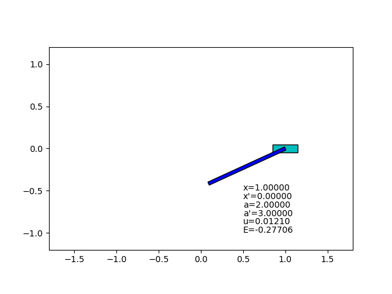
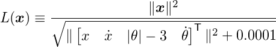
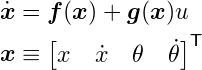
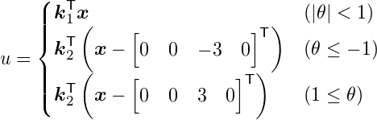
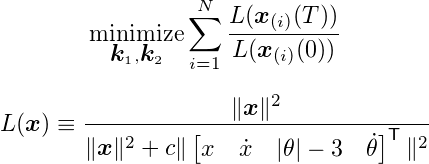

  
Sample result of v1

  
Sample result of v2 (added on 14 Oct. 2018)

# Optimization of Swing-up Control

This is an optimization experiment for [the previous program](../prog04_swing_up_control) which is manually adjusted swing-up control of an inverted pendulum.
In this program the feedback gain parameters are calculated by optimization.
The objective function is defined on top of physical simulation implemented on TensorFlow.

The aim of this optimization is to find *most efficient* feedback gain, with which to swing-up the pendulum from arbitrary initial state and to stabilize it at upright position.

## What I learned

I have tried to find the way to design a controller with very little knowledge of the target system.
I know, for such purposes, reinforcement learning is the most commonly used approach.
But since I am new in machine learning, I wanted to know how optimization algorithms can be applied directly to those problems and what is the difficulty or the limitation.

As I learned from this challenge, it is very important and actually very difficult to design an appropriate and effective objective function for the problem.

But it is possible.
The way I found is to carefully design an objective function based on physical simulation of the target system and to design the distribution of initial states for good measurement of the performance.

### Addition for v2 (14 Oct. 2018)

There are two versions of the program v1 and v2.
After I have made v1 and uploaded it, I struggled with improvement for robustness of optimization and finally made v2.
v2 shows slightly smarter motion than v1.

The differences between them are definition of controller and objective function.

- All the $\theta$ in controller and objective function in v1 are replaced with $\theta - round(\theta / 2\pi) * 2\pi$ in v2. This allows inverse rotation.
- The loss function $L(x)$ is changed to as below in order to make the optimization more stable.

Note that the details described below is based on v1.

## In some detail

The equation of motion of the inverted pendulum is represented with a state equation as below

where $x \in \Re^4$ (x in bold) is the state variable, $x$ (not in bold) is horizontal position of the cart, $\theta$ is angle of the pole and $u$ is force to push the cart as control input.
And the control input is given by a state feedback controller defined as below

where $k_1, k_2 \in \Re^4$ are constant feedback gain which is the variable we are going to optimize.

Our objective function is:

where $x(t)$ is value $x$ (the state variable) at time $t$, the subscript $(i)$ means *i-th trial of simulation* for which prearranged N random initial states are used,
and $L(x)$ is a loss function carefully defined in the state space.
In my experiment (the code in this repository), the constants used are $N = 1000, T = 2, c = 5$.

The loss function $L(x)$ expresses our objective that the pendulum should be near upright position ($[0, 0, 0, 0]$) and apart from hanging position ($[0, 0, \pm 3, 0]$).

The whole calculation of optimization is performed in a single invocation of SciPy Optimizer via TensorFlow interface.
The initial values of the variables for the optimization process are $k_1 = [0, 0, 0, 0]^T, k_2 = [0, 0, 0, 0]^T$.

## Migration from TensorFlow 1.x to TensorFlow 2.x (2022-08-13)

All these experiments above have been done with TensorFlow 1.x. Now, TensorFlow 1.x is obsolete and not recommended. So I have migrated the scripts to TensorFlow 2.x and added them as different names with a prefix `_tf2` (`run_v1_tf2.py` and `run_v2_tf2.py`).

But unfortunately, the `_tf2` versions seem like they rarely get success to optimize the controller. I guess the cause is in the different implementation of the L-BFGS optimizer and/or the difference in its default hyperparameters.

## Changelog

### 2022-18-13
- Added `_tf2` versions to run with TensorFlow 2.x.

### 2018-10-14
- Added v2:
    - Improved robustness.

### 2018-09-27
- Initial version (v1)
