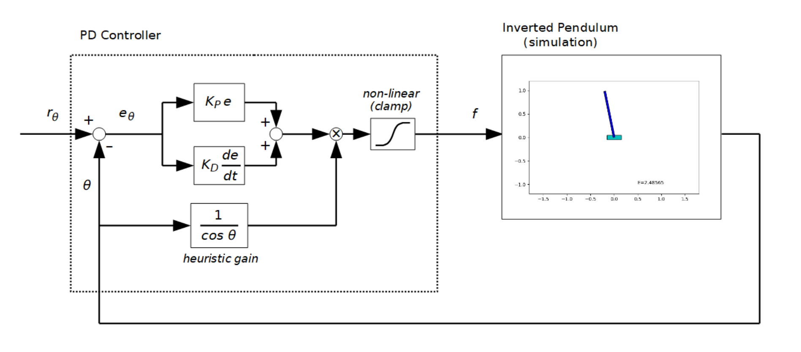

https://user-images.githubusercontent.com/732920/185763491-f1fde0c7-ef82-4716-ac0f-7c2682142635.mp4

<video src="figs/sample_output.mp4" style="width:100%" loop autoplay muted controls></video>

# PD Control

This is a simulation of an inverted pendulum with a manually adjusted PD controller.

The objective of the controller is to control the pendulum to arbitrary angles.
It works as shown in the animation above.
Obviously, the horizontal position of the cart ($x$) is left uncontrolled. Because this PD controller can control only a single variable.

You may also notice a small amount of residual error, I think it is due to the absence of the integral component in the controller.

## Swing-up and the heuristic gain

I was surprised that how easy with this controller to swing up a pendulum starting from the bottom position.

The secret of this magic is the heuristic gain I inserted into the system (see it in the above diagram). The output value of the PD controller is multiplied by the heuristic gain to compensate for varying sensitivity between the input force and the pendulum angle. As a result, the pendulum moves with its angular acceleration approximately proportional to the original output of the controller. I think it means that the pendulum system is virtually linearized. That is the reason why a PD controller can perform swinging up of a pendulum.

<video src="figs/swing_up1.mp4" style="width:100%" loop autoplay muted controls></video>
`initial_state = np.array([ 0.0, 0.0, 3.1416, 0.0 ])`

<video src="figs/swing_up2.mp4" style="width:100%" loop autoplay muted controls></video>
`initial_state = np.array([ 0.0, 0.0, -8.25, 0.0 ])`

## Changelog

### 2022-08-24
- Added 'Swing-up and the heuristic gain' section showing some more simulation results and discussing the heuristic gain.

### 2022-08-21
- Initial version
