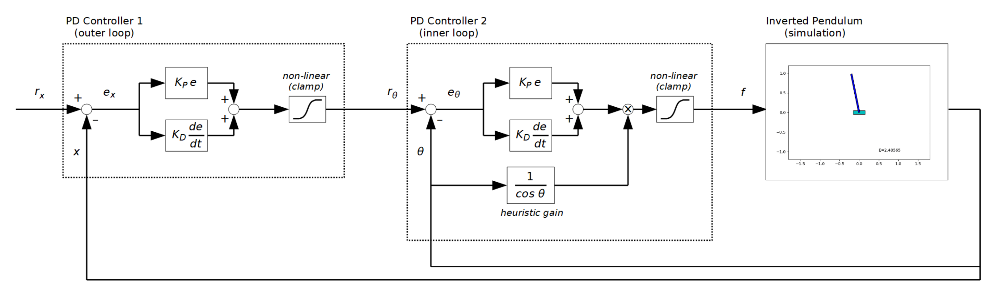

https://user-images.githubusercontent.com/732920/185798783-b69f1d3c-990a-4f65-a21a-9fee59c081f8.mp4

<video src="figs/sample_output.mp4" style="width:100%" loop autoplay muted controls></video>

# Cascaded PD Control

This is a simulation of an inverted pendulum with a manually adjusted cascaded PD controller.

This work has been made based on [the previously-made non-cascaded PD controller](../prog06_pd_control/).

As shown in the block diagram below this entire controller consists of two PD controllers.
The outer one (the left in the diagram) controls the cart position $x$, and the inner one (the right) controls the pendulum angle $\theta$. The output of the outer controller is the setpoint (reference or target value) of the inner controller. This chaining of controllers relies on the nature of an angle-controlled inverted pendulum - if the pendulum leans the cart will accelerate in that direction.

## Note
- I've finally found a working and simple swing-up controller of an inverted pendulum.

### 2022-08-22
- Initial version
